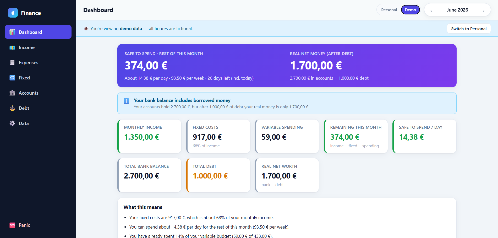
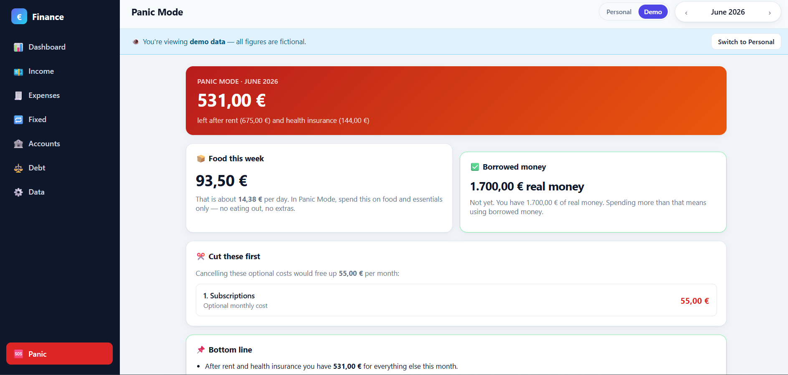
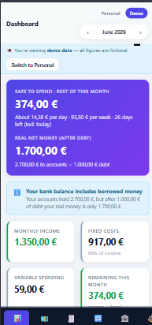

# 💶 Finance Tracker

A clean, mobile-first **personal finance tracker** built for the reality of
**variable monthly income**. It turns raw numbers into plain-language
advice: how much is safe to spend per day, whether fixed costs are too high, and —
crucially — how much money is *really* yours once debt is subtracted.

**Local-first** (data lives in your browser by default) with **optional** account-based
**cloud sync** across devices. No tracking. Installable as a PWA. Built with
**React + TypeScript + Vite** and an optional **Supabase** backend for sync.

> 🔒 **Privacy by design:** the public source and demo contain only *fictional* data.
> Real data is entered in **Personal mode** — kept on-device by default, or in your own
> private Supabase project if you opt into cloud sync.

<!-- Add real images to docs/screenshots/ then these will render -->


| Panic Mode | Mobile |
| :--------: | :----: |
|  |  |

---

## Why I built it

Most budgeting apps assume a fixed monthly salary. This one is built for the
opposite case — **variable income** that changes month to month, sometimes
arrives late, and sits in an account next to money that's actually borrowed.
Tools that assume a steady paycheck can make a balance look healthier than it
really is. The app answers a single question honestly:

> *"Given everything — variable income, fixed bills, and debt — how much can I
> actually spend today without getting into trouble?"*

It doubles as a portfolio project: production-quality React + TypeScript,
real financial logic, and deployment.

## Features

- **Dashboard** — income, fixed costs, variable spending, remaining money, bank
  balance, total debt, **debt-aware real net worth**, and safe-to-spend per day/week.
- **Variable income tracking** — enter each payment manually; income is grouped by a
  **budget month** so money earned one month but spent the next counts correctly.
- **Expense tracking** — categorised, per-account, fully editable.
- **Fixed costs** — recurring bills you can add/edit/end/delete, with payment dates.
  Each cost has an optional start/end month, so *ending* a cancelled cost (or
  *adding* a new one) only changes the months it actually applies to — past months
  are never silently rewritten.
- **Bank accounts** — manual balances and account types.
- **Debt tracking** — separate ledger with repayment progress; clearly *not* free money.
- **Safe-to-spend engine** — daily and weekly limits from what's left in the month.
- **Monthly savings goal** — optionally set an amount aside each month *before* anything
  counts as spendable; warnings fire when spending starts eating into it. The app suggests
  an amount (~20% of what's typically left after fixed costs — a variable-income-friendly
  take on the 50/30/20 rule). Panic Mode deliberately ignores the goal — surviving the
  month comes first.
- **Recommended category budgets** — splits the month's variable budget across
  categories (groceries, eating out, …) based on your own spending history (with
  sensible defaults until enough history exists). Needs are protected on tight
  months — wants get squeezed first — and each category gets its own pace warning.
- **Warning engine** — automatic alerts when:
  - fixed costs exceed 70% of income,
  - you're spending faster than the calendar,
  - the projected end-of-month balance goes negative,
  - your real net worth is much lower than your bank balance because of debt,
  - a fixed cost (e.g. health insurance) is about to be debited.
- **Panic Mode** — a stripped-down survival view: money left after rent + health
  insurance, this week's food budget, what to cut first, and whether you're spending
  borrowed money.
- **Personal / Demo modes** — keep real data private; show fictional data to visitors.
- **Optional cloud sync** — sign in (email/password) to sync your Personal data across
  devices via Supabase. The app works fully without it, too.
- **Data portability** — export to **CSV**, full **JSON backup/import**, reset demo data.
- **PWA** — installable to your phone home screen, works offline.
- **Responsive** — sidebar on desktop, bottom tab bar on mobile.

## Engineering Highlights

- **Local-first data persistence** — single serialisable `AppData` object mirrored to
  `localStorage`; survives refresh, exportable/importable, with structural validation
  on load so corrupt data can't crash the app.
- **Privacy-aware architecture** — Personal and Demo datasets are stored under separate
  keys and switched at runtime; no real data is ever hard-coded in source.
- **Optional cloud sync** — Supabase auth + Postgres with Row Level Security, layered on
  top of the local-first store (debounced last-write-wins push, pull on sign-in/focus),
  with graceful fallback to local-only when no backend is configured.
- **Financial forecasting logic** — projects end-of-month balance from current spending
  pace and compares budget-used vs. time-elapsed to detect overspending early.
- **Debt-aware net worth** — `real_net_worth = total_bank − total_debt`, surfaced
  everywhere so borrowed money is never mistaken for spendable money.
- **Budget warning engine** — pure functions turn the numbers into ranked,
  human-readable warnings (`danger` / `warning` / `info` / `safe`).
- **Pure, framework-free domain layer** — all money math lives in `src/lib/` with no
  React or DOM dependencies, making it easy to read, reason about, and test.
- **Responsive, accessible UI** — hand-built component library and charts, zero UI/chart
  dependencies, mobile-first CSS.
- **Resilience** — React error boundary with a one-click data-reset recovery screen.
- **Deployment-ready** — type-checked production build, Vercel config, and a dependency-free
  Node script that generates the PWA icons.

## Tech stack

| Area | Choice |
| ---- | ------ |
| Framework | React 18 + TypeScript (strict) |
| Build tool | Vite 5 |
| State | React Context + hooks (no external state lib) |
| Styling | Hand-written CSS (CSS variables, mobile-first) |
| Charts | Custom, dependency-free (CSS/flex bars) |
| Persistence | `localStorage` (local-first) |
| Auth & sync *(optional)* | Supabase (Auth + Postgres, Row Level Security) |
| PWA | Web app manifest + minimal service worker |
| Deploy | Vercel (static) |

Beyond React, the **only** runtime dependency is the optional Supabase client (used
solely for sign-in + sync). The UI and charts are hand-built with zero dependencies —
deliberately, to keep the app small, fast, and easy to audit.

## Run locally

Requires Node 18+.

```bash
npm install      # install dependencies
npm run dev      # start the dev server (http://localhost:5173)
npm run build    # type-check + production build -> dist/
npm run preview  # preview the production build locally
npm run icons    # (optional) regenerate the PWA icons
```

The dev server is exposed on your local network, so you can open the **Network** URL
it prints on your phone (same Wi-Fi) to test mobile.

## Deploy to Vercel

This is a static Vite app — deployment is zero-config.

**Option A — dashboard:**
1. Push this repo to GitHub.
2. On [vercel.com](https://vercel.com), **Add New → Project** and import the repo.
3. Vercel auto-detects Vite (Build: `npm run build`, Output: `dist`). Click **Deploy**.

**Option B — CLI:**
```bash
npm i -g vercel
vercel          # preview deploy
vercel --prod   # production deploy
```

The included `vercel.json` pins the framework, build command, output directory, and an
SPA rewrite. Without sync env vars, the public deployment keeps everything in
`localStorage`, shows **Demo mode** to visitors, and never has access to any real data.

## Cloud sync (optional)

By default the app is local-only — no account needed. To sync your **Personal** data
between devices (laptop ↔ phone), connect a free **Supabase** project:

1. Create a project at [supabase.com](https://supabase.com) (free tier).
2. In the dashboard → **SQL Editor**, run the contents of
   [`supabase/schema.sql`](supabase/schema.sql). It creates a `finance_data` table with
   Row Level Security so each user can only access their own data.
3. In **Settings → API**, copy your **Project URL** and **anon public** key.
4. Add them as environment variables:
   - **Locally:** copy `.env.example` → `.env` and fill in the values.
   - **On Vercel:** Project → **Settings → Environment Variables** → add
     `VITE_SUPABASE_URL` and `VITE_SUPABASE_ANON_KEY`, then redeploy.
5. *(Optional)* For instant sign-up without email confirmation:
   **Authentication → Providers → Email** → turn **Confirm email** off.
6. In the app → **Data** tab → **Sign in to sync** → create an account. Use the same
   account on each device and your Personal data stays in sync.

When the variables are absent, the app runs in local-only mode — the sign-in UI is
hidden and nothing breaks. The Supabase **anon key is safe to expose** in the frontend;
security is enforced by Row Level Security on the database.

## Add to your phone (PWA)

1. Open the deployed site in your mobile browser.
2. **iОS Safari:** Share → *Add to Home Screen*.
   **Android Chrome:** menu → *Install app* / *Add to Home screen*.
3. Launch it from your home screen — it runs full-screen and works offline.

## Project structure

```
src/
  main.tsx              App entry (error boundary, auth + store providers, SW registration)
  App.tsx               Layout, navigation, mode toggle, demo/sync banners
  store.tsx             Context store: Personal/Demo modes, localStorage + cloud sync
  auth.tsx              Supabase auth context (sign in / up / out, session)
  types.ts              Data model (AppData and friends)
  defaults.ts           Fictional demo data + empty dataset (no real data)
  index.css             Global styles (mobile-first, theme variables)
  lib/
    calculations.ts     Finance engine: summaries, warnings, advice, panic, category budgets
    format.ts           Currency / date / month helpers
    csv.ts              CSV export + JSON backup/download
    gigShift.ts         Split-payment helper for variable gig income
    supabase.ts         Supabase client (no-op when unconfigured)
    cloud.ts            Pull/push the user's data to Supabase
  components/
    ui.tsx              Reusable UI primitives (Card, Stat, Modal, Segmented, …)
    charts.tsx          Dependency-free bar/proportion charts
    AccountSync.tsx     Sign-in form + sync status panel
    ErrorBoundary.tsx   Crash recovery screen
  pages/                One file per section (Dashboard, Income, Expenses, …)
public/                 manifest, service worker, icons
supabase/
  schema.sql            Database table + Row Level Security policies
scripts/
  generate-icons.mjs    Dependency-free PNG icon generator
```

## How the safe-to-spend math works

For the selected month (full details in `src/lib/calculations.ts`):

```
monthly_income        = sum of income whose budget month is the month
fixed_costs           = sum of fixed costs that apply to the month
                        (each cost has an optional start/end month)
variable_spending     = sum of expense entries in the month, excluding transfers
                        (moving money between your own accounts isn't spending)
remaining_money       = monthly_income − fixed_costs − variable_spending
spendable_remaining   = remaining_money − savings_goal (optional, default 0)
safe_to_spend_per_day = spendable_remaining / days_left (incl. today)
weekly_limit          = safe_to_spend_per_day × min(7, days_left)

real_net_worth        = total_bank − total_debt
```

## Future improvements

- Recurring-income templates and auto-rollover of fixed costs each month.
- Optional charts over time (monthly trend, savings rate).
- Multi-currency support.
- End-to-end encryption for cloud-synced data (currently last-write-wins).
- Real-time multi-device updates (live sync) instead of pull-on-open.
- Unit tests for the finance engine (the pure `lib/` layer is built for it).
- Manual overrides for the recommended category budgets.

## License

MIT — see `LICENSE`. Personal project; use it freely.
